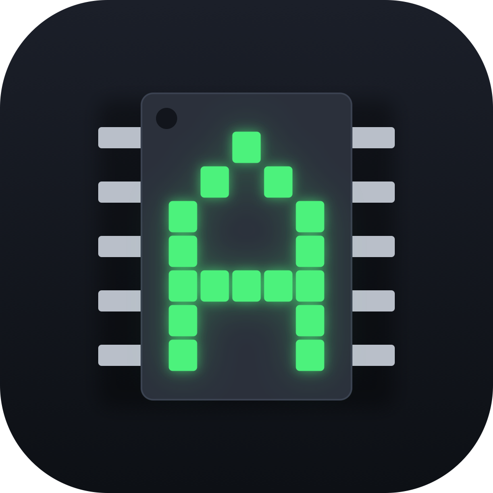
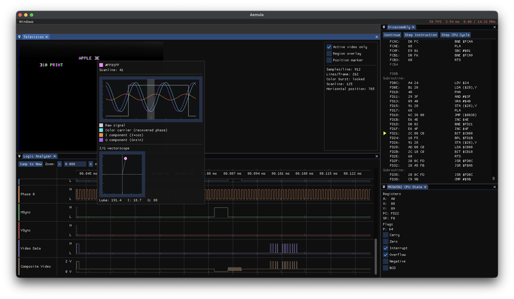

# Aemula [](https://github.com/tgjones/aemula/actions/workflows/CI.yml)



Aemula is a pin-level hardware emulation of classic computers and game consoles from the 8-bit era.

Aemula emulates classic computers and consoles at the level of the chips that
actually made them up, not the level of the programs they ran. Where many
emulators implement a CPU as an instruction interpreter and a video chip as a
frame-buffer painter, Aemula builds each chip - CPU, video/audio generators,
and the surrounding 74-series glue logic - as its own class with real pins,
wired together net-by-net the way the schematic wires them. A chip doesn't
execute an instruction set; it reacts to the state of its input pins on every
clock edge, the same as the physical part would.

That approach extends all the way to the screen. Rather than writing pixels
into a frame buffer, Aemula's video-generating systems produce a stream of
composite-video voltage samples - a "real" analog television signal,
complete with sync pulses, blanking, and a color-burst reference. A
separate `Television` decoder consumes that signal exactly as a physical CRT
would: separating sync from picture, locking a color-burst PLL, and
demodulating YIQ chroma from the luma signal. This makes artifact
color on machines like the Apple II fall out for free - it's a real property of decoding an analog signal, not a special-cased effect.

Aemula's built-in debugger includes a logic analyzer that traces any wired-up signal, a scope-style television
window that shows exactly where sync, blanking, and color burst land in the
raster, and disassemblers/breakpoints for the emulated CPUs - all inspecting
the same pins and signals a real hardware debugger would.

## Supported systems

**Working**

* Apple II

**Aspirational** - some support exists but these aren't really working yet:

* BBC Micro
* Acorn System 1
* NES
* Atari 2600
* Space Invaders

See each system's folder under
[`src/Aemula/Emulation/Systems`](src/Aemula/Emulation/Systems) for reference
material and implementation notes.

## Getting started

Aemula isn't yet distributed in binary form. For now it's necessary to build from source.

Aemula targets .NET 10 (see [`global.json`](global.json)) and uses
[`src/Aemula.slnx`](src/Aemula.slnx) as its solution file.

```sh
git clone https://github.com/tgjones/aemula.git
cd aemula/src
dotnet build Aemula.slnx
```

Run the SDL/ImGui-based debugger UI, passing the system to emulate and
optionally a program/ROM to load:

```sh
dotnet run --project Aemula.UI -- appleii
dotnet run --project Aemula.UI -- nes path/to/game.nes
```

Valid system names are `appleii`, `atari2600`, `chip8`, `nes`, and
`spaceinvaders`. The Apple II and Space Invaders ROMs are already bundled
under their systems' `Roms/` folders; other systems expect a program path as
the second argument.

## Screenshots



More screenshots coming.

## Credits

This project was directly inspired by Lee Hammerton's [EDL](https://github.com/SavourySnaX/EDL) project, which is one of the few other projects I know of that does emulation at this level. In particular, EDL [also does "real" NTSC encoding](https://savourysnax.github.io/EDL/images/nes.png), which is how I got started down this particular rabbit hole.

Reference material and prior art for individual chips and systems is linked from each system's and chip's own `README.md` under [`src/Aemula/Emulation`](src/Aemula/Emulation).

ROM images included in this repository remain the copyright of their
original publishers and are included solely to make emulation easier to try
out; see the `README.txt` alongside each ROM for details.

## License

Aemula is licensed under the [MIT License](LICENSE.txt).
